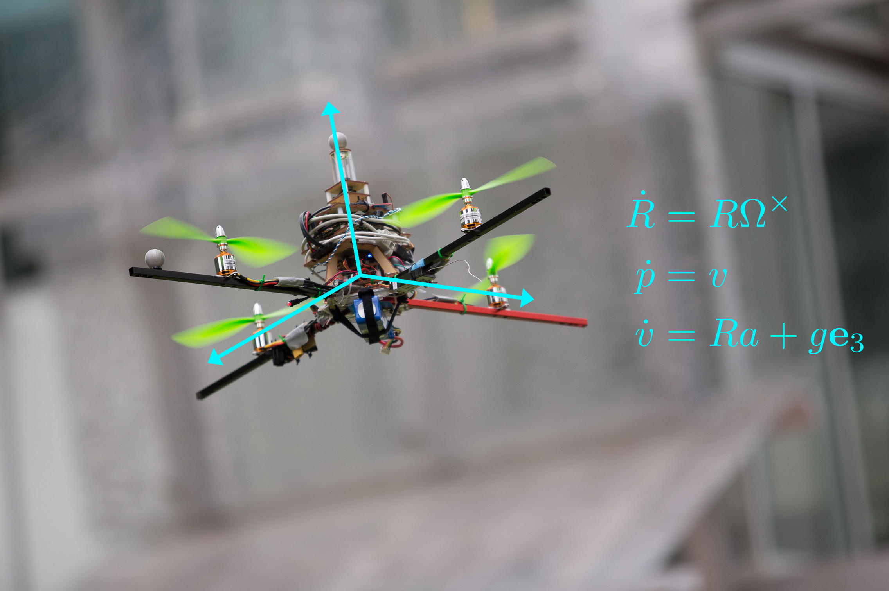


Our ongoing research into equivariant systems has yielded a range of state estimation algorithms for systems on Lie groups and homogeneous spaces.
We develop the general framework of equivariant systems theory to yield generic observer designs such as the Equivariant Filter (EqF), which has been shown to outperform state-of-the-art alternatives in problems such as attitude estimation and Visual Inertial Odometry (VIO).
This research also examines system invariances that can be exploited to yield observers with synchronous error dynamics (depending only on a choice of correction term) and (almost-)global stability properties.


<!--  -->

## Main investigators

- Yixiao (Shawn) Ge
- Pieter van Goor
- Robert Mahony

## Collaborators and international partners

- Jochen Trumpf (ANU)
- Tarek Hamel (University of Nice-Sophia Antipolis)
- Minh-Duc Hua (University of Nice-Sophia Antipolis)

## Related publications

- Fornasier, Alessandro, Yonhon Ng, Christian Brommer, Christoph Böhm, Robert Mahony, and Stephan Weiss. “Overcoming Bias: Equivariant Filter Design for Biased Attitude Estimation with Online Calibration.” IEEE Robotics and Automation Letters, 2022, 1–8. https://doi.org/10.1109/LRA.2022.3210867.
- Ge, Yixiao, Pieter van Goor, and Robert Mahony. “Equivariant Filter Design for Discrete-Time Systems,” September 12, 2022. https://doi.org/10.48550/arXiv.2209.04965.
- van Goor, Pieter, Tarek Hamel, and Robert Mahony. “Equivariant Filter (EqF).” IEEE Transactions on Automatic Control, 2022, 1–13. https://doi.org/10.1109/TAC.2022.3194094.
- van Goor, Pieter, and Robert Mahony. “Autonomous Error and Constructive Observer Design for Group Affine Systems.” In 2021 60th IEEE Conference on Decision and Control (CDC), 4730–37, 2021. https://doi.org/10.1109/CDC45484.2021.9683560.
- ———. “EqVIO: Equivariant Filter for Visual Inertial Odometry.” Submitted to IEEE Transactions on Robotics, 2022.
- Hua, M., M. Zamani, J. Trumpf, R. Mahony, and T. Hamel. “Observer Design on the Special Euclidean Group SE(3).” In 2011 50th IEEE Conference on Decision and Control and European Control Conference, 8169–75, 2011. https://doi.org/10.1109/CDC.2011.6160453.
- Khosravian, Alireza, Jochen Trumpf, Robert Mahony, and Christian Lageman. “Observers for Invariant Systems on Lie Groups with Biased Input Measurements and Homogeneous Outputs.” Automatica 55 (May 1, 2015): 19–26. https://doi.org/10.1016/j.automatica.2015.02.030.
- Mahony, R., T. Hamel, and J. Pflimlin. “Nonlinear Complementary Filters on the Special Orthogonal Group.” IEEE Transactions on Automatic Control 53, no. 5 (June 2008): 1203–18. https://doi.org/10.1109/TAC.2008.923738.
- Mahony, Robert, Pieter van Goor, and Tarek Hamel. “Observer Design for Nonlinear Systems with Equivariance.” Annual Review of Control, Robotics, and Autonomous Systems 5, no. 1 (May 3, 2022): 221–52. https://doi.org/10.1146/annurev-control-061520-010324.
- Mahony, Robert, Tarek Hamel, Pascal Morin, and Ezio Malis. “Nonlinear Complementary Filters on the Special Linear Group.” International Journal of Control 85, no. 10 (October 1, 2012): 1557–73. https://doi.org/10.1080/00207179.2012.693951.
- Mahony, Robert, Tarek Hamel, and Jochen Trumpf. “Equivariant Systems Theory and Observer Design.” ArXiv:2006.08276 [Cs, Eess], August 29, 2020. http://arxiv.org/abs/2006.08276.
- Mahony, Robert, Jochen Trumpf, and Tarek Hamel. “Observers for Kinematic Systems with Symmetry.” In IFAC Proceedings Volumes, 46:617–33. 9th IFAC Symposium on Nonlinear Control Systems, 2013. https://doi.org/10.3182/20130904-3-FR-2041.00212.
