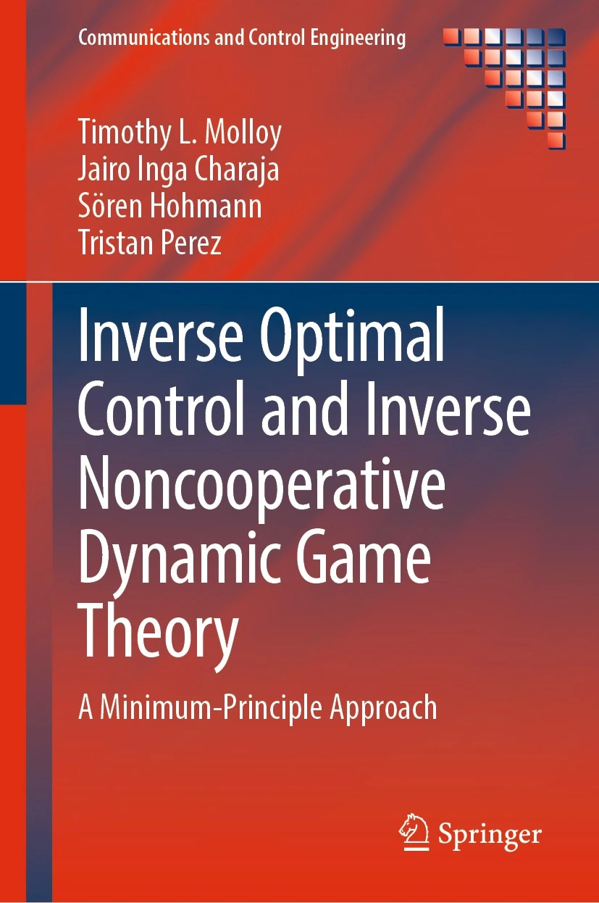


We are conducting research that seeks to enable engineered systems to infer the criteria of optimality underlying the actions and decisions of experts. This research has thus far explored fundamental theory and practical algorithms for studying the mid-air collision avoidance behaviour of birds, the driving behaviour of humans, and the decisions of players in competition and conflict. The broad applicability and versatility of our research is due to its focus on understanding the fundamental structure of these inverse problems, and their connections to the mathematics of optimal control and dynamic game theory.


<!--  -->
## Main investigators

- Tim Molloy
- Iman Shames

## Collaborators and international partners

- Tristan Perez (The Boeing Company)
- Jairo Inga Charaja (Karlsruhe Institute of Technology)
- Sören Hohmann (Karlsruhe Institute of Technology)
- Jason Ford (Queensland University of Technology)

## Related publications

1. Molloy, Timothy L., Jairo Inga Charaja, Sören Hohmann, and Tristan Perez. "Inverse Optimal Control and Inverse Noncooperative Dynamic Game Theory." Springer Nature, 2022.
2. Molloy, Timothy L., Jason J. Ford, and Tristan Perez. "Online inverse optimal control for control-constrained discrete-time systems on finite and infinite horizons." Automatica 120, 2020, 109109.
3. Molloy, Timothy L., Jairo Inga, Michael Flad, Jason J. Ford, Tristan Perez, and Sören Hohmann. "Inverse open-loop noncooperative differential games and inverse optimal control." IEEE Transactions on Automatic Control 65, no. 2, 2019, 897-904.
4. Inga, Jairo, Esther Bischoff, Timothy L. Molloy, Michael Flad, and Sören Hohmann. "Solution sets for inverse non-cooperative linear-quadratic differential games." IEEE Control Systems Letters 3, no. 4, 2019, 871-876.
5. Molloy, Timothy L., Jason J. Ford, and Tristan Perez. "Finite-horizon inverse optimal control for discrete-time nonlinear systems." Automatica 87, 2018, 442-446.
6. Molloy, Timothy L., Jason J. Ford, and Tristan Perez. "Online inverse optimal control on infinite horizons." In 2018 IEEE conference on decision and control (CDC), 2018, 1663-1668.
7. Molloy, Timothy L., Grace S. Garden, Tristan Perez, Ingo Schiffner, Debajyoti Karmaker, and Mandyam V. Srinivasan. "An inverse differential game approach to modelling bird mid-air collision avoidance behaviours." IFAC-PapersOnLine 51, no. 15, 2018, 754-759.
8. Tsai, Dorian, Timothy L. Molloy, and Tristan Perez. "Inverse two-player zero-sum dynamic games." In 2016 Australian Control Conference (AuCC), 2016, 192-196.
