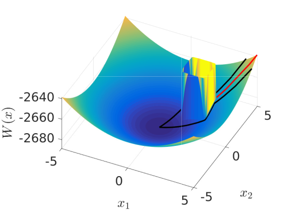


Even after more than 100 years, Lyapunov methods still are one of the main tools in the controller design and in the stability analysis of dynamical systems. In recent years the focus has shifted from stability to safety and obstacle avoidance. In this research stream we focus on combined problems of asymptotic stability and simultaneous obstacle avoidance for (nonlinear) constrained underactuated systems. Combining results on nonsmooth Lyapunov and control Lyapunov functions, hybrid systems and discontinuous feedback laws we focus on theoretical results as well explicit control formulations and controller designs.


<!--  -->

## Main investigators

- Philipp Braun
- Chris Kellett
- Iman Shames

## Collaborators and international partners

- Lars Grüne (University of Bayreuth, Germany)
- Luca Zaccarian (University of Trento, Italy & LAAS-CNRS Toulouse, France)

## Related publications

1.     1. R. Ballaben, P. Braun, L. Zaccarian; Orchestrating front and rear sensors for global stabilization of unicycles, presented at 25th International Symposium on Mathematical Theory of Networks and Systems, 4 pages, 2022
2. P. Braun, L. Grüne, C. M. Kellett, (In-)Stability of Differential Inclusions: Notions, Equivalences and Lyapunov-like Characterizations, VIII+119 pages, 2021, SpringerBriefs in Mathematics
3. P. Braun, L. Zaccarian, Augmented obstacle avoidance controller design for mobile robots, in: Proceedings of the 7th IFAC Conference on Analysis and Design of Hybrid Systems, IFAC-PapersOnLine 54(5): 157–162, 2021
4. P. Braun, C. M. Kellett, L. Zaccarian, Explicit construction of stabilizing robust avoidance controllers for linear systems with drift, IEEE Transactions on Automatic Control 66(2): 595–610, 2021
5. P. Braun, C. M. Kellett, Comment on “Stabilization with guaranteed safety using Control Lyapunov–Barrier Function”, Automatica 122, 109225, 2020
6. P. Braun, C. M. Kellett, L. Zaccarian, Uniting control laws: On obstacle avoidance and global stabilization of underactuated linear systems, in: Proceedings of the 58th IEEE Conference on Decision and Control, pages 8154–8159, 2019
7. R. Baier, P. Braun, L. Grüne, C. M. Kellett, Numerical calculation of nonsmooth control Lyapunov functions via piecewise affine approximation, in: Proceedings of the 11th IFAC Symposium on Nonlinear Control Systems, IFAC-PapersOnLine 52(16): 370–375, 2019
8. P. Braun, C. M. Kellett, L. Zaccarian, Complete control Lyapunov functions: Stability under state constraints, in: Proceedings of the 11th IFAC Symposium on Nonlinear Control Systems, IFAC-PapersOnLine 52(16): 358–363, 2019
9. P. Braun, L. Grüne, C. M. Kellett, Complete instability of differential inclusions using Lyapunov methods, in: Proceedings of the 57th IEEE Conference on Decision and Control, pages 718–724, 2018
10. R. Baier, P. Braun, L. Grüne, C. M. Kellett, Numerical construction of nonsmooth control Lyapunov functions, Large-Scale and Distributed Optimization, Lund, (Editors: A. Rantzer and P. Gisselson), Springer, pages 343–373, 2018
11. P. Braun, C. M. Kellett, L. Zaccarian, Unsafe point avoidance in linear state feedback, in: Proceedings of the 57th IEEE Conference on Decision and Control, pages 2372–2377, 2018
12. P. Braun, L. Grüne, C. M. Kellett, Feedback Design Using Nonsmooth Control Lyapunov Functions: A Numerical Case Study for the Nonholonomic Integrator, in: Proceedings of the 56th IEEE Conference on Decision and Control, pages 4890-4895, 2017
