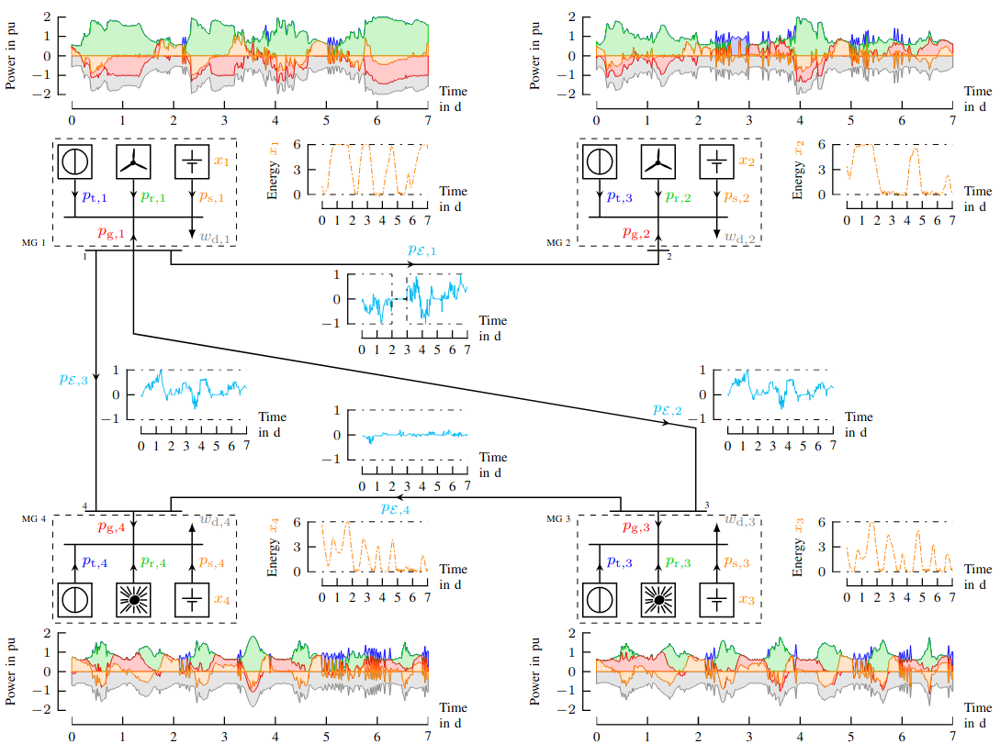


In this research stream we investigate distributed optimisation schemes embedded in model predictive control algorithms to mitigate these difficulties. In particular, we investigate the potential degree of freedom of small-scale distributed storage devices (such as batteries) and flexible loads in the grid. The corresponding control laws, scheduling the charging and discharging behaviour of the storage devices and the controllable loads, are within the area of demand-side management.


<!--  -->

## Main investigators

- Philipp Braun
- Chris Kellett

## Collaborators and international partners

- Timm Faulwasser (Technical University Dortmund, Germany)
- Lars Grüne (University of Bayreuth, Germany)
- Christian Hans (Technical University Berlin, Germany)
- Steve Weller (University of Newcastle, Australia)
- Karl Worthmann (Technical University Ilmenau, Germany)

## Related publications

1. P. Braun, L. Grüne, C. M. Kellett, S. R. Weller, K. Worthmann. Towards price-based predictive control of a small scale electricity network, International Journal of Control 93(1): 40–61, 2020
2. C. A. Hans, P. Braun, J. Raisch, L. Grüne, C. Reincke-Collon, Hierarchical distributed model predictive control of interconnected microgrids, IEEE Transactions on Sustainable Energy 10(1): 407–416, 2019
3. P. Braun, P. Sauerteig, K. Worthmann, Distributed optimization based control on the example of microgrids, Computational Intelligence and Optimization Methods for Control Engineering, Springer, pages 173–200, 2019
4. P. Braun, L. Grüne, Distributed optimization: Applications in model predictive control, at-Automatisierungstechnik, 66(11): 939-949, 2018
5. P. Braun, T. Faulwasser, L. Grüne, C. M. Kellett, S. R. Weller, K. Worthmann. Hierarchical distributed ADMM for predictive control with applications in power networks, IFAC Journal of Systems and Control 3: 10–22, 2018
6. P. Braun, L. Grüne, C. M. Kellett, S. R. Weller, K. Worthmann. A Distributed Optimization Algorithm for the Predictive Control of Smart Grids, IEEE Transactions on Automatic Control 61(12):3898–3911, 2016
7. P. Braun, T. Faulwasser, L. Grüne, C. M. Kellett, S. R. Weller, K. Worthmann, Maximal islanding time for microgrids via distributed predictive control, in: Proceedings of the 22nd International Symposium on Mathematical Theory of Networks and Systems (MTNS), Minneapolis, USA, pages 652–659, 2016
8. P. Braun, L. Grüne, C. M. Kellett, S. R. Weller, K. Worthmann, Model Predictive Control of Residential Energy Systems Using Energy Storage & Controllable Loads, Progress in Industrial Mathematics at ECMI 2014, Heidelberg: Springer, 2016, pages 617–623 - (Mathematics in Industry; 22)
9. K. Worthmann, C. M. Kellett, P. Braun, L. Grüne, S. R. Weller. Distributed and Decentralized Control of Residential Energy Systems Incorporating Battery Storage, IEEE Transactions on Smart Grid, 6(4):1914-1923, 2015
10. P. Braun, L. Grüne, C. M. Kellett, S. R. Weller, K. Worthmann. A Real-Time Pricing Scheme for Residential Energy Systems Using a Market Maker, in: Proceedings of the 5th Australian Control Conference (AuCC), pages 259–262, 2015
11. P. Braun, L. Grüne, C. M. Kellett, S. R. Weller, K. Worthmann. Predictive Control of a Smart Grid: a Distributed Optimization Algorithm with Centralized Performance Properties, in: Proceedings of the 54th IEEE Conference on Decision and Control (CDC), Osaka, Japan, pages 5593–5598, 2015
