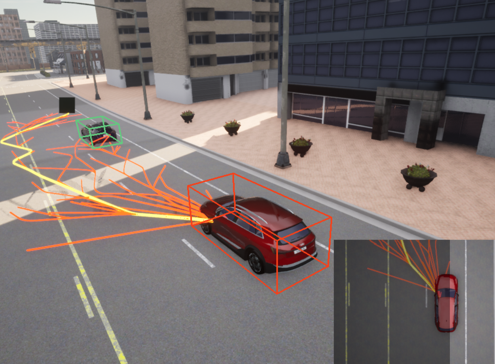


In this research stream we focus on developing an integrated perception, decision, and control framework for a novel autonomy stack that incorporates the inherent uncertainties and nonlinearities of robotic systems. Combining results from nonlinear control, optimal control, formal methods, and estimation theory as well as cutting edge nonlinear and stochastic programming and planning methods,  we focus on developing a perception, decision, and control framework for safe autonomous systems.


<!--  -->

## Main investigators

- Iman Shames
- Philipp Braun

## Collaborators and international partners

- Lars Grüne (University of Bayreuth, Germany)
- Luca Zaccarian (University of Trento, Italy & LAAS-CNRS Toulouse, France)
- Tyler H Summers (University of Texas at Dallas)

## Related publications

1. R. Ballaben, P. Braun, L. Zaccarian, Orchestrating front and rear sensors for global stabilization of unicycles, presented at 25th International Symposium on Mathematical Theory of Networks and Systems, 4 pages, 2022
2. V. Renganathan, S. Safaoui, A. Kothari, B. Gravell, I Shames, T. H. Summers,
Risk bounded nonlinear robot motion planning with integrated perception & control, Artificial Intelligence, Volume 314,
 103812, 2023
1. D Selvaratnam, M Cantoni, JM Davoren, I Shames, Sampling polynomial trajectories for LTL verification, Theoretical Computer Science 897, 135-163, 2022
1. A Pavlov, I Shames, C Manzie, Interior point differential dynamic programming, IEEE Transactions on Control Systems Technology 29 (6), 2720-2727, 2021
3. P. Braun, L. Zaccarian, Augmented obstacle avoidance controller design for mobile robots, in: Proceedings of the 7th IFAC Conference on Analysis and Design of Hybrid Systems, IFAC-PapersOnLine 54(5): 157–162, 2021
4. P. Braun, C. M. Kellett, L. Zaccarian, Explicit construction of stabilizing robust avoidance controllers for linear systems with drift, IEEE Transactions on Automatic Control 66(2): 595–610, 2021
1. O Biggar, M Zamani, I Shames, An expressiveness hierarchy of behavior trees and related architectures, IEEE Robotics and Automation Letters 6 (3), 5397-5404
5. P. Braun, C. M. Kellett, Comment on “Stabilization with guaranteed safety using Control Lyapunov–Barrier Function”, Automatica 122, 109225, 2020
1. D Burke, A Chapman, I Shames, Generating minimum-snap quadrotor trajectories really fast, 2020 IEEE/RSJ International Conference on Intelligent Robots and Systems (IROS), 1487-1492, 2020
9. P. Braun, L. Grüne, C. M. Kellett, Complete instability of differential inclusions using Lyapunov methods, in: Proceedings of the 57th IEEE Conference on Decision and Control, pages 718–724, 2018
10. R. Baier, P. Braun, L. Grüne, C. M. Kellett, Numerical construction of nonsmooth control Lyapunov functions, Large-Scale and Distributed Optimization, Lund, (Editors: A. Rantzer and P. Gisselson), Springer, pages 343–373, 2018
12. P. Braun, L. Grüne, C. M. Kellett, Feedback Design Using Nonsmooth Control Lyapunov Functions: A Numerical Case Study for the Nonholonomic Integrator, in: Proceedings of the 56th IEEE Conference on Decision and Control, pages 4890-4895, 2017
